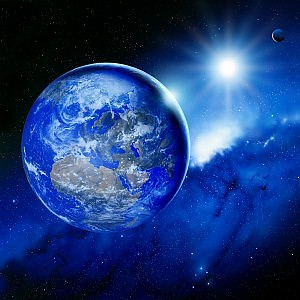

<html>

     
       <head>
    
    <title>gagandeep-webpage</title>
    
       </head>

            <body>
    
    <h1>hello world!!!</h1>
    
    <h2>A few facts about the world we live in.</h2>       
           
           

      
      

La Terra è il terzo pianeta in ordine di distanza dal Sole e il più grande dei pianeti terrestri del sistema solare, sia per massa sia per diametro.

È il luogo primigenio degli esseri umani ed, essendo l'unico corpo planetario del sistema solare adatto a sostenere la vita come da noi concepita e conosciuta, è anche l’unico luogo nel quale vivono tutte le specie viventi conosciute.

Sulla sua superficie, si trova acqua in tutti e tre gli stati (solido, liquido e gassoso) e un'atmosfera composta in prevalenza da azoto e ossigeno che, insieme al campo magnetico che avvolge il pianeta, protegge la Terra dai raggi cosmici e dalle radiazioni solari.

La sua formazione è datata a circa 4,54 miliardi di anni fa. La Terra possiede un satellite naturale chiamato Luna la cui età, stimata analizzando alcuni campioni delle rocce più antiche, è risultata compresa tra 4,29 e 4,56 miliardi di anni.

<ul>

<h3>About the earth:</h3>

<li>Diametro equatoriale (km)12.756,3</li>
<li>Densità media (kg/m3) 5520</li>
<li>Periodo di rotazione (lunghezza del giorno)23h 56m 04s</li>

<ul>

<h3>Top 2 facts about earth:</h3>

<li> The Earth's rotation is gradually slowing</li>
<li> The Earth's was one believed to be the centre of the universe</li>
    
    <table style="widht:50%">
    
    <thead style="color: blue">
    
     <tr>
        
      <th>NAMES</th>
      <th>RADIUS</th>
      <th>Average Temperature</th>  
        
        </tr>  
        
        
         </thead>
    
    <tbody>
        
        <tr>
        
        <td>Mars</td>
        <td>3,403Km</td>
        <td>-46°C</td>
        
        
        </tr>
        
        <tr>
            <td>venere</td>
            <td>6,052</td>
            <td>462°</td>
        </tr>
        
        
        </tbody>

    
    
    
    </table>
    
    <a href="page2.html">collegato alla seconda pagina</a>

                                                                                                    

</body>

</html> 
